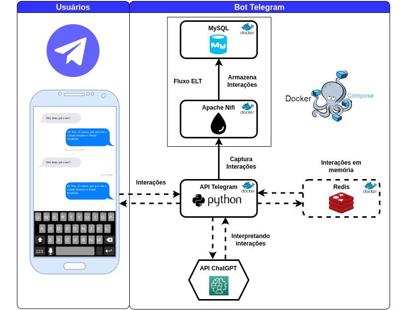

# Fluxo de Desenvolvimento - Bot Telegram



> ***Obs.:*** Este repositório é apenas para fins educacionais e não deve ser usado em ambientes produtivos, pois isso pode levar a problemas de segurança, estabilidade e desempenho.


# Requisitos para implementação

- Ubuntu 20.04

- Docker 23.0.3

- Docker-Compose 1.25.0

- Python 3.8 ou superior

- Apache Nifi 1.19.0

- MySQL 5.7.40

- Redis 7.0.10


# Passos da implementação


#### Passo 1 - Criando um bot no Telegram

- Abra o Telegram e pesquise por "BotFather".

- Inicie uma conversa com o BotFather e envie o comando "/newbot".

- Siga as instruções do BotFather para dar um nome e um username ao seu bot.

- O BotFather irá gerar uma API token para o seu bot. Anote essa chave, pois ela será necessária para conectar seu bot ao Telegram.

> ***Lembre-se*** de que existem diversas funcionalidades que podem ser adicionadas ao seu bot, como respostas automáticas, integração com outras plataformas, criação de comandos personalizados, entre outras. 


#### Passo 2 - Criando o Token do ChatGPT

- Acesse o site da OpenAI (https://openai.com/) e crie uma conta.

- Após criar sua conta, acesse a página de gerenciamento de API Keys (https://beta.openai.com/docs/api-reference/authentication).

- Clique no botão ***"Create new API key"*** para gerar uma nova chave.

- Você precisará fornecer um nome descritivo para a chave que está criando.

- Após criar sua chave, você poderá visualizá-la e gerenciá-la na página de gerenciamento de API Keys.

> ***Importante*** ressaltar que cada modelo da OpenAI tem suas próprias diretrizes e restrições de uso, e você deve seguir as políticas de uso aceitável para cada modelo.


#### Passo 3 - Atualize o arquivo de parâmetros

Acesse o arquivo ***'.env'*** e atualize os Tokens recem criados.

```bash
TOKEN_TELEGRAM=<Seu Token do Bot Telegram>
TOKEN_CHATGPT3=<Seu Token do ChatGPT>
```

#### Passo 4 - Criando a imagem Docker para o Bot Telegram

```bash
cd criando-bots-telegram/bot01
```

```bash
docker build -f dockerfile -t bot-app:0.0.1 .
```

#### Passo 5 - Criando volumes e configurando permissões para aplicação Bot Telegram

- Criando o volume do Bot Telegram

```bash
docker volume create --name=bot-dados-telebot
```

```bash
docker volume create --name=bot-dados-mysql
```

- Alterando as permissões de acesso ao diretório do volume 'bot-dados-telebot'

```bash
sudo su
```

```bash
chmod 766 /var/lib/docker/volumes/bot-dados-telebot/_data
```

> ***Obs.:*** Como o volume 'bot-dados-telebot' será compartilhado entre o contêiner com aplicação em Python e o contêiner com o Apache Nifi, foi necessário alterar as permissões de leitura e escrita para que ambos tenham acesso adequado.


#### Passo 6 - UP dos Serviços via Docker-Compose

```bash
cd criando-bots-telegram/
```

```bash
docker-compose -f docker-compose.yaml --compatibility up -d && docker cp bot01/deploy/mysql-connector-j-8.0.31.jar bot-nifi:/home/nifi
```


> ***Obs.:*** O Driver JDBC que será utilizado no Apache Nifi será enviado para o contêiner através do comando 'docker cp...', não sendo a melhor maneira, mas sim a mais prática.


####  Passo 7 -  Configurações Finais - Apache Nifi

Para configurar o fluxo do Apache Nifi que captura as interações dos usuários com o bot e, em seguida, grava no banco de dados, os seguintes passos devem ser executados:

- Acesse via terminal o endereço: https://localhost:8443/nifi/

> ***Obs.:*** usuário e senha do Apache Nifi estão no arquivo ***'docke-compose.yaml'***

- Importe o Flow existente na pasta ***'deploy'*** como um novo template.

> ***Obs.:*** arquivo ***'FLOW_CAPTURA_INTERACOES_BOT_TELEGRAM_....xml'***

- Adicione a senha do MySQL no controle service existente nos processors ***'ExecuteSQL'***

> ***Obs.:*** senha do MySQL está no arquivo ***'docke-compose.yaml'***

- Ative todo o Flow clicando em ***'Start'***.

#### Flow Apache Nifi


####  Passo 8 -  Down dos Serviços via Docker-Compose

```bash
docker-compose -f docker-compose.yaml --compatibility down
```


# Resultado da Implementação

xxxxxxxxxxxxxxxxxxxxxxxxxxxxx

# Considerações Finais

Ao final deste processo, você terá criado uma aplicação estruturada que utiliza as principais tecnologias e ferramentas existentes atualmente. Embora este seja um ambiente não produtivo, é válido para você entender como é feita a implementação e orquestração de tantas soluções para serem executadas em conjunto em busca de um determinado propósito.


# Referências:

Python, **python.org**. Disponível em: <https://www.python.org/>. Acesso em: 6 abril de 2023.

Telebot, **KyleJamesWalker**. Disponível em: <https://github.com/KyleJamesWalker/telebot>. Acesso em: 7 abril de 2023.

Telebot, **Pypi.org**. Disponível em: <https://pypi.org/project/telebot/>. Acesso em: 6 abril de 2023.

Install Docker Engine on Ubuntu, **Docker Docs**. Disponível em: <https://docs.docker.com/engine/install/ubuntu/>. Acesso em: 9 abril de 2023.

Docker Compose overview, **Docker Docs**. Disponível em: <https://docs.docker.com/compose/>. Acesso em: 6 abril de 2023.

Introduction, **OpenAI**. Disponível em: <https://platform.openai.com/docs/api-reference>. Acesso em: 5 abril de 2023.

Apache NiFi Overview, **Apache Nifi**. Disponível em: <https://nifi.apache.org/docs.html>. Acesso em: 6 abril de 2023.

Apache Nifi, **Docker Hub**. Disponível em: <https://hub.docker.com/r/apache/nifi>. Acesso em: 6 abril de 2023.

redis-py - Python Client for Redis, **Redis**. Disponível em: <https://redis-py.readthedocs.io/en/stable/index.html>. Acesso em: 6 abril de 2023.

Redis, **Docker Hub**. Disponível em: <https://hub.docker.com/_/redis>. Acesso em: 6 abril de 2023.

MySQL, **MySQL**. Disponível em: <https://www.mysql.com/>. Acesso em: 6 abril de 2023.

MySQL, **Docker Hub**. Disponível em: <https://hub.docker.com/_/mysql>. Acesso em: 6 abril de 2023.
